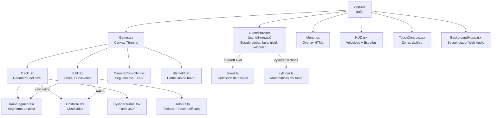

# 🌐 SPHERA

**Sphera** es un juego de acción 3D en el navegador donde controlas una esfera luminosa que rueda a alta velocidad por pistas imposibles. Esquiva obstáculos, salta sobre huecos y recoge estrellas mientras la velocidad aumenta sin parar. ¿Llegarás al arco de meta?

Inspirado en el clásico *Slope*, construido completamente con tecnologías web modernas.

---

## 🎮 Cómo Jugar

| Acción | Teclado | Móvil |
|--------|---------|-------|
| Moverse izquierda | `←` / `A` | Tocar mitad izquierda |
| Moverse derecha | `→` / `D` | Tocar mitad derecha |
| Saltar | `Space` | Tocar la zona superior (45% de pantalla) |

- **Estrella**: recoge las 3 estrellas flotantes por nivel
- **Game Over**: cae por un hueco, choca con un obstáculo, o sale de la pista
- **Level Complete**: llega al arco de llegada al final del nivel

---

## 🛠 Stack Tecnológico

| Tecnología | Versión | Rol |
|-----------|---------|-----|
| **React** | 19 | UI y manejo de estado |
| **TypeScript** | 6 | Tipado estático |
| **Vite** | 8 | Bundler y servidor de desarrollo |
| **Three.js** | 0.184 | Renderizado 3D |
| **@react-three/fiber** | 9 | Integración React + Three.js |
| **@react-three/drei** | 10 | Helpers para fiber |
| **Web Audio API** | — | Música procedural y efectos de sonido |

---

## 📦 Librerías Principales

| Paquete | Propósito |
|---------|-----------|
| `three` | Geometrías, materiales, cámara, raycasting, matrices |
| `@react-three/fiber` | `useFrame`, `Canvas`, montaje declarativo de objetos 3D |
| `@react-three/drei` | Utilidades (no activamente usadas en producción, disponible) |
| `react` / `react-dom` | Árbol de componentes, contexto global de estado, overlays HTML |

> No se usa ningún motor de física externo (Cannon-es, Rapier, etc.). Toda la física (gravedad, colisiones, saltos) está implementada manualmente en `Ball.tsx` usando raycasting y AABB.

---

## 🏗 Arquitectura

El proyecto separa claramente tres capas: **motor 3D**, **lógica de juego** e **interfaz HTML**.



### Capas

| Capa | Archivos | Responsabilidad |
|------|----------|----------------|
| **Estado** | `gameStore.tsx` | Máquina de estados del juego (home → playing → gameOver…), progreso persistido en `localStorage` |
| **Motor 3D** | `Game.tsx`, `Ball.tsx`, `Track.tsx`, `CameraController.tsx` | Canvas Three.js, física manual, colisiones, cámara |
| **Niveles** | `levels.ts`, `cylinder.ts` | Definición declarativa de pistas, obstáculos, estrellas y secciones de cilindro |
| **Entrada** | `useInput.ts`, `useKeys.ts` | Teclado y touch unificados en un `Set<string>` de teclas activas |
| **UI** | `Menu.tsx`, `HUD.tsx`, `TouchControls.tsx` | Overlays HTML sobre el Canvas |
| **Audio** | `BackgroundMusic.tsx` | Secuenciador procedural con Web Audio API |

---

## 📂 Componentes Principales

| Componente / Módulo | Archivo | Qué hace |
|--------------------|---------|----------|
| `GameProvider` | `store/gameStore.tsx` | Contexto global: fase del juego, nivel actual, velocidad, estrellas recogidas, progreso persistido |
| `Game` | `components/Game.tsx` | Monta el `<Canvas>` de Three.js y los registries de meshes compartidos entre `Track` y `Ball` |
| `Ball` | `components/Ball.tsx` | Física completa: gravedad, steering lateral, salto con coyote time + jump buffer, colisión con obstáculos (AABB) y detección de suelo (raycasting) |
| `Track` | `components/Track.tsx` | Construye la geometría del nivel a partir de `LevelDef`, gestiona meshes de segmentos, obstáculos y estrellas |
| `TrackSegment` | `components/TrackSegment.tsx` | Segmento individual de pista (box rotado) con bordes neón |
| `Obstacle` | `components/Obstacle.tsx` | Obstáculo visual + registra su mesh para colisiones AABB |
| `CylinderTunnel` | `components/CylinderTunnel.tsx` | Renderiza el túnel 360° con instanced meshes para los obstáculos de la pared |
| `CameraController` | `components/CameraController.tsx` | Seguimiento tercera persona + encuadre cinemático dentro del cilindro + FOV dinámico |
| `BackgroundMusic` | `components/BackgroundMusic.tsx` | Música procedural (chiptune) con secuenciador Web Audio; efecto de muerte al perder |
| `levels.ts` | `src/levels.ts` | Definición estática de los 3 niveles: piezas, obstáculos, estrellas, velocidades |
| `cylinder.ts` | `src/cylinder.ts` | Cómputo de secciones de cilindro y generación determinista de obstáculos con LCG |
| `useInput` | `hooks/useInput.ts` | Unifica teclado y touch en un `Set<string>` de teclas activas, sin delay |

---

## 🚀 Desarrollo Local

```bash
# Instalar dependencias
npm install

# Iniciar servidor de desarrollo (hot reload)
npm run dev

# Build de producción
npm run build
```

El juego corre en `http://localhost:5173` por defecto.

---

## 🗺 Niveles

| # | Nombre | Dificultad | Velocidad base → máx | Mecánicas especiales |
|---|--------|-----------|----------------------|----------------------|
| 1 | Principiante | Fácil | 24 → 46 u/s | Pistas estrechas, huecos, obstáculos mixtos |
| 2 | Intermedio | Media | 32 → 68 u/s | Pendientes agresivas + túnel cilíndrico 360° |
| 3 | Experto | Difícil | 44 → 92 u/s | Secciones ultra-estrechas + 2 túneles cilíndricos |

---

## 📝 Notas Técnicas

- **Sin motor de física**: toda la física es manual (`useFrame` + integración de Euler). Esto permite control total de la "game feel" sin overhead de un motor externo.
- **Registries de meshes**: `Game.tsx` mantiene arrays `trackMeshes` y `obstacleMeshes` que se limpian al inicio de cada run para evitar colisiones fantasma por meshes stale del ciclo anterior.
- **Colisiones**: el suelo se detecta con un `Raycaster` descendente; los obstáculos usan AABB (sphere-vs-box) con distance culling de ±30 unidades en Z.
- **Cinemática de cámara**: `CameraController` blendea suavemente entre encuadre normal y encuadre del túnel usando smoothstep + exponential lerp FPS-independent.
