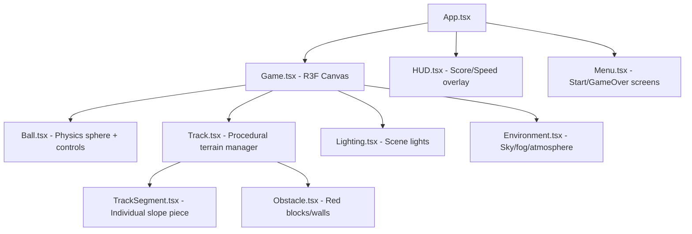

# 🎮 Slope Game Clone — React + Three.js

## Difficulty Assessment

| Aspect | Difficulty | Notes |
|--------|-----------|-------|
| 3D Rendering | ⭐⭐ Medium | Three.js handles heavy lifting; `@react-three/fiber` gives React bindings |
| Physics | ⭐⭐⭐ Medium-High | Ball rolling, gravity on slopes, collision detection |
| Procedural Terrain | ⭐⭐⭐ Medium-High | Infinite track generation with ramps, gaps, obstacles |
| Game Feel & Polish | ⭐⭐ Medium | Camera follow, speed ramping, particle effects |
| UI/State | ⭐ Low | Score counter, menus — standard React |

**Overall: ⭐⭐⭐ Medium-High** — Achievable in a single session with the right libraries. The trickiest parts are physics tuning and procedural terrain that feels fun.

## Tech Stack

| Tool | Purpose |
|------|---------|
| **Vite + React** | Fast dev server, HMR, project scaffold |
| **@react-three/fiber** | React renderer for Three.js |
| **@react-three/drei** | Helpers (camera, lighting, etc.) |
| **cannon-es** + **@react-three/cannon** | Physics engine with React bindings |
| **Vanilla CSS** | UI overlays (menus, HUD) |

> [!NOTE]
> We avoid raw Three.js imperative code. `@react-three/fiber` lets us declare the 3D scene as JSX components, which is idiomatic React and much easier to maintain.

## Architecture Overview



## Proposed Changes

### Project Setup

#### [NEW] Project scaffold via Vite
```
npx -y create-vite@latest ./ --template react
```
Then install 3D/physics dependencies:
```
npm install three @react-three/fiber @react-three/drei cannon-es @react-three/cannon
```

---

### Core Game Components

#### [NEW] `src/components/Game.tsx`
The main 3D canvas container. Sets up:
- `<Canvas>` with camera config (FOV, position, near/far)
- `<Physics>` provider from `@react-three/cannon`
- Child components: Ball, Track, Lighting, Environment

#### [NEW] `src/components/Ball.tsx`
The player-controlled sphere:
- Uses `useSphere` hook from `@react-three/cannon` for physics body
- Keyboard input (← → or A/D) applies lateral forces
- Constant forward velocity that increases over time
- Metallic/glossy material with environment reflection
- Collision detection → triggers game over if falls off or hits obstacle

#### [NEW] `src/components/Track.tsx`
Procedural terrain manager:
- Maintains a pool of ~20 track segments ahead of the ball
- Recycles segments behind the ball (object pooling)
- Randomly generates: straight sections, left/right turns, ramps, gaps
- Each segment is a `useBox` physics body (static, mass=0)

#### [NEW] `src/components/TrackSegment.tsx`
Individual track piece:
- Box geometry with neon-edge glow material
- Slight color variation per segment for visual depth
- Static physics body

#### [NEW] `src/components/Obstacle.tsx`
Red/warning-colored blocks on the track:
- Static physics body
- Collision with ball → game over
- Glowing emission material

#### [NEW] `src/components/Lighting.tsx`
Scene lighting:
- Ambient light (low intensity, blue tint)
- Directional light following the ball
- Optional point lights on obstacles for dramatic effect

#### [NEW] `src/components/Environment.tsx`
Atmospheric effects:
- Dark space/void background
- Fog for depth perception and hiding segment pop-in
- Optional starfield particles

---

### UI Layer

#### [NEW] `src/components/HUD.tsx`
In-game overlay (HTML, not 3D):
- Current score (distance traveled)
- Current speed multiplier
- Minimal, semi-transparent design

#### [NEW] `src/components/Menu.tsx`
Start screen and game-over screen:
- "SLOPE" title with neon glow effect
- "Press SPACE to Start" prompt
- Game over: final score + "Play Again" button
- Premium glassmorphism design

---

### State Management

#### [NEW] `src/store/gameStore.ts`
Simple React context or zustand-like state:
- `gameState`: 'menu' | 'playing' | 'gameOver'
- `score`: number (distance)
- `speed`: number (increases over time)
- `startGame()`, `endGame()`, `resetGame()`

---

### Styling

#### [NEW] `src/index.css`
- Dark theme base
- Neon color palette (cyan, magenta, green accents)
- Google Font (Orbitron for sci-fi feel)
- Glassmorphism for UI panels
- Smooth transitions and animations

---

## Visual Design Direction

- **Theme**: Dark space / neon cyber — like the original Slope game
- **Color palette**: Deep black background, neon green track edges, cyan ball glow, red obstacles
- **Typography**: Orbitron (Google Font) — futuristic monospace feel
- **Effects**: Fog, bloom-like glow on materials, speed lines at high velocity

## Verification Plan

### Automated Tests
- Run `npm run dev` and verify the game loads
- Ball responds to keyboard input
- Track generates ahead and recycles behind
- Collision with obstacles triggers game over
- Score increases during play

### Manual Verification (Browser)
- Open in browser, play through a full run
- Verify smooth 60fps performance
- Check that terrain variety is interesting
- Confirm UI transitions (menu → playing → game over → restart)

## Open Questions

> [!IMPORTANT]
> 1. **Controls**: ¿Prefieres flechas del teclado (← →) o A/D? ¿O ambos?
> 2. **Mobile support**: ¿Necesitas controles táctiles para móvil o solo desktop por ahora?
> 3. **Scoring**: ¿Solo distancia recorrida o también quieres coleccionables (gemas/puntos)?
> 4. **Sound**: ¿Quieres efectos de sonido y música de fondo? (Podemos añadirlo después)
